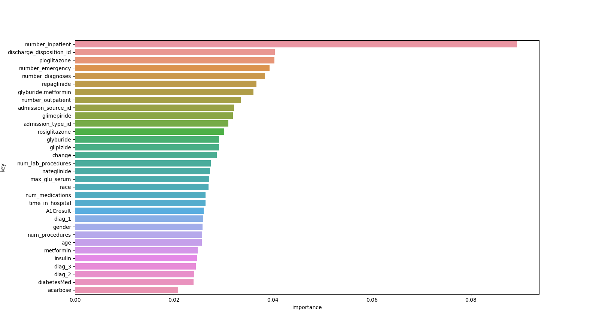
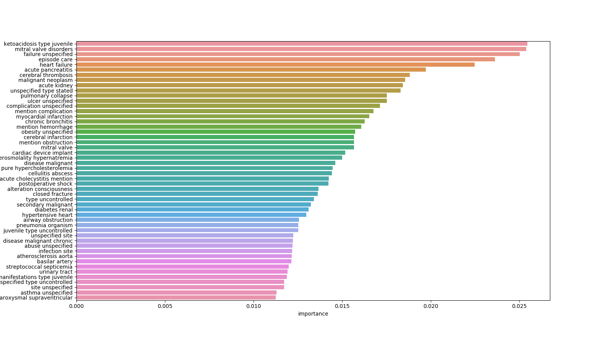

## **Project 2 - Diabetes Readmission Prediction**
by Martin Tschechne, Han Bai, Nora Moser

### **Motivation**

In this work we identify the important features for readmission prediction of patients diagnosed with diabetes. Further we study the influence of additional textual data from the differential diagnoses on model performance. Specifically it is not goal of this work to produce a overcomplicated model with perfect evaluation scores on this binary classification problem, but to provide explainability. This is utmost important in medical applications where decisions have to be transparent.

### **Data**
The data set is a subsample of the UCI Machine Learning Repository [2] and represents 10 years of clinical care from 130 US hospitals. For a detailed description of each feature, we refer to the publication introducing the data set [1].

|Data Description|Features| Missing Values|
|---|---|---|
|**Number of Samples**: 10.000 **Class 0**: No readmission or only after 30 days (60.35%) **Class 1**: Readmission within 30 days (39.65%)        |- **Categorical**: e.g. 'race', 'gender'   - **Numerical**: e.g. 'num_medications'   - **Text**: e.g. 'diag_1_desc'        |race (2.21%) weight (95.92%) admission_type_id (7.21%) discharge_disposition_id (4.69%) admission_source_id (9.36%) payer_code (53.41%) medical_specialty (41.0%) diag_1 (0.02%) diag_2 (0.59%) diag_3 (2.08%)|

### **Modeling**
- Feature Extraction:

By looking at feature characteristics we decided to drop features with high amounts of  missing values (e.g. 'weight') and those with low variance (e.g. 'acetohexamide'). The categorical feature 'age' was transformed into a numerical value by taking the mean value of the age interval. Other categorical values like 'max_glu_serum' ('None','norm','>200','>300') or 'metformin' ('No','Steady','Up','Down') were also transformed to numerical, values according to a mapping. ICD9 codes from the 'diag_1','diag_2','diag_3' features were grouped into coarser categories like 'circulatory' or 'respiratory' according to the publication introducing the data set [1].

- Textual Features:

Textual features correspond to the ICD9 codes. The text for a given code is always the same , e.g. "Diabetes mellitus without mention of complication, type I [juvenile type], not stated as uncontrolled" for ICD code 250.01. Text was stripped of stop words and vectorized by TFIDF with bi- and tri-grams. Uni-grams were omitted since single words are less informative in a medical context than word combinations ('heart' versus 'heart failure'). The dimension for a single diagnosis was constrained to 200.

- ML Models:

Since the main focus is not to deliver a single model, a subset of the most common standard models was tested without hyperparameter optimization. Training was performed on 80% (60% training and 20% validation) of the data, the remaining 20% was used to report performance.

- Feature Selection:

Feature importance scores for categorical / numerical features as well as for textual features were produced by looking at XGBoost feature importances. The most important features can be seen in the Appendix. A subset of the most important features was selected and models were trained first on all features, later just on selected features.

### **Results & Discussion**

All models using the categorical / numerical features perform better than the NIR. However not by a great margin. Since many features have low variance and conditional distributions, given the readmission class, are not discriminative enough, more data or extensive feature engineering is needed to further improve performance. Models only using text features in form of tfidf-vectors perform generally worse than their counterparts. A possible explanation is that the text of the ICD-9 codes is the same for each code. Thus representing the codes in categorical values (e.g. ordinal-encoded or one-hot-encoded) should provide the same information. Combinations of keyword co-occurrences in the three diagnoses could hint to higher chances of readmission. However as can be seen from the results this assumption does not hold compared to non-textual features.  
From the feature importance scores extracted from the XGBoost model one can see that numerical values such as the number of inpatient stays or the number of emergencies of a patient are indicators if a patient will be readmitted within the next 30 days. Categorical values such as the discharge disposition ID (to where a patient is discharged, transferred or referred after his stay) and the change in pioglitazone medication are important for readmission indication as well.  

By looking at which combination of words are important one can observe that medical terms associated with heart disease ("mitral valve disorders", "heart failure") as well as other organ diseases ("acute pancreatitis", "acute kidney") play a important role to decide if a patient is likely to be readmitted within the next 30 days. The most important keyword "ketoacidosis type juvenile" hints to a potentially life-threatening complication of diabetes mellitus (<a href="https://en.wikipedia.org/wiki/Diabetic_ketoacidosis" title = "ketoacidosis">wiki</a>) in its early stage.  
From the feature importance scores we selected a subset and trained each model again, in a last step we combined categorical / numerical with text features to investigate if the performance improves. By reducing the number of degrees of freedom in the model (i.e. reducing the number of features) we simplify the model and reduce the possibilities to overfit the data. Theoretically we reduce the models variance by introducing a little more bias, resulting in a more stable estimation of performance less prone to overfitting. This behavior is the case for categorical / numerical values but interestingly not the case for the text features. From the notebook it can be seen that a large portion of the text features have little or no importance thus only inducing noise to the data. Reducing the level of noise can lead to more accurate predictions. However still no model yields a higher score than the NIR.
Combining features has little to no influence on the performance and if so only negative.  
We conclude predicting the readmission of diabetes patients from the given features is difficult. The additional provided text descriptions of ICD-9 codes does not solve this issue, but can give valuable insights which diseases indicate higher likelihood of readmission. Further we could identify specific numerical features which can be seen as important indicator for readmission.  

Bold numbers indicate best performing models for each set of features.

|Model|Num./Cat. Features N=37|Text Features N=3*200|
|---|---|---|
|SVM (linear)|F1: 0.626 AUROC: 0.546|F1: **0.597** AUROC: 0.500|
|SMV (rbf)|F1: 0.647 AUROC: 0.584|F1: 0.594 AUROC: 0.501|
|SMV (poly,d=3)|F1: 0.632 AUROC: 0.558|F1: 0.594 AUROC: **0.507**|
|Log.Reg.|F1: 0.629 AUROC: 0.568|F1: 0.580 AUROC: 0.488|
|Random Forest|F1: **0.658** AUROC: 0.609|F1: 0.546 AUROC: 0.509|
|XGBoost|F1: 0.654 AUROC: **0.620**|F1: 0.577 AUROC: 0.490|
|MLP|F1: 0.633 AUROC: 0.582|F1: 0.587 AUROC: 0.495|
|Naive Bayes|F1: 0.625 AUROC: 0.550|F1: 0.516 AUROC: 0.508|

|Model|Num./Cat. Features N=15|Text Features N=3*54|Num./Cat. + Text Features N=15+3*54|
|---|---|---|---|
|SVM (linear)|F1: 0.626 AUROC: 0.546|F1: 0.601 AUROC: 0.499|F1: 0.625 AUROC: 0.546|
|SMV (rbf)|F1: 0.636 AUROC: 0.578|F1: 0.592 AUROC: 0.500|F1: 0.637 AUROC: 0.578|
|SMV (poly,d=3)|F1: 0.624 AUROC: 0.546|F1: 0.585 AUROC: **0.502**|F1: 0.623 AUROC: 0.546|
|Log.Reg.|F1: 0.623 AUROC: 0.559|F1: 0.595 AUROC: 0.494|F1: 0.617 AUROC: 0.556|
|Random Forest|F1: 0.624 AUROC: 0.592|F1: 0.572 AUROC: **0.502**|F1: 0.612 AUROC: 0.582|
|XGBoost|F1: **0.653** AUROC: **0.612**|F1: 0.589 AUROC: 0.496|F1: **0.641** AUROC: **0.598**|
|MLP|F1: 0.631 AUROC: 0.575|**F1: 0.604** AUROC: 0.500|F1: 0.629 AUROC: 0.575|
|Naive Bayes|F1: 0.623 AUROC: 0.565|F1: 0.534 AUROC: 0.484|F1: 0.557 AUROC: 0.515|

### **Feature Importance**

Feature importance plots for categorical / numerical features and text features.

|Cat./Num. Features|
|---|
||

|Text Features|
|---|
||

### **Reproducibility**

To reproduce the results, download the zipped data form the sources mentioned above. Create the folders `data` and `data/raw` inside the project folder. Extract the zip-file inside `data/raw`. Execute the notebook `Project-2-Diabetes.ipynb`.

### **References**
[1] Impact of HbA1c Measurement on Hospital Readmission Rates: Analysis of 70,000 Clinical Database Patient Records. [https://doi.org/10.1155/2014/781670](https://doi.org/10.1155/2014/781670)

[2] Diabetes 130-US hospitals for years 1999-2008 Data Set ([link](https://archive.ics.uci.edu/ml/datasets/diabetes+130-us+hospitals+for+years+1999-2008#))
