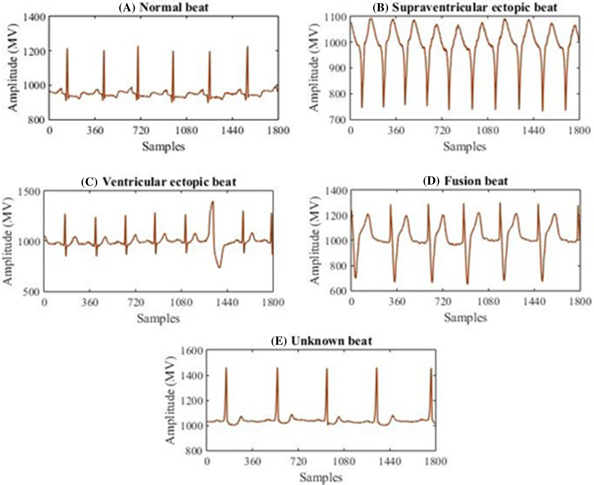
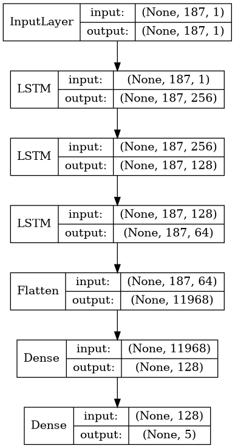
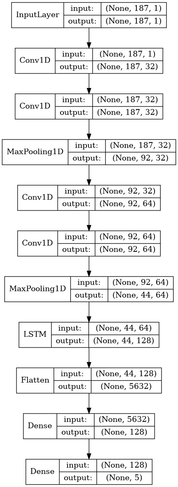

## **Project 1 - ECG Time Series**
by Martin Tschechne, Han Bai, Nora Moser

### **Motivation**

Electrocardiograms (ECG) are a non-invasive, inexpensive quick technique to visualize the heartbeat of a patient and therefore a commonly used method in medicine to discover diseases and malfunctions of the heart, such as rhythm disturbances or inadequate blood flow. Due to the vast availability of ECGs, thanks to wearables and mobile devices, automatically analyzing these becomes more and more important.  
In contrast to the huge amount of data available, labeling data is still a manual very expensive job which takes human experts hundreds of hours. Often times it is infeasible to label all data. However to reduce overfitting and build well-generalizing machine learning models large amounts of training examples are needed. To overcome this issue <i>Transfer Learning</i> becomes a valuable approach. Transfer Learning makes use of a pre-trained model, trained on a large data set to solve a similar tasks with structurally identical data and retraining i.e. fine-tuning this model on the data set of interest. Pre-trained models have already learned low-level features present in both data sets and can therefore be utilized as feature-extractors. Training a new model from scratch becomes unnecessary. This speeds up training and improves generalization of models.

 

Above are five examples of different ECG signals, representing different beat patterns (normal and unnormal), taken from the MIT-BIH data set.

### **Task**

The first task at hand was to train a Recurrent Neural Network model on ECG time signals on two different data sets independently (one multi-class data set and one binary-class data set), in order to classify characteristic beat patterns.  
Secondly the model from the larger multi-class data set is used as feature-extractor for the smaller binary-class data set and retrained with frozen layers and unfrozen layers. Here the effect of transfer learning on performance metrics such as Accuracy, F1-Score, AUCOR and AUCPR is studied.  
Further, more sophisticated model architectures such as combinations of Convolutional Neural Networks and LSTM cells or gradient boosting instead of fully-connected layers are tested.

### **Data**

|Arrhythmia Dataset|The PTB Diagnostic ECG Database|
|---|---|
|Number of Samples: 109446  Number of Categories: 5  Sampling Frequency: 125Hz Data Source: [Physionet's MIT-BIH Arrhythmia Dataset](https://www.physionet.org/physiobank/database/mitdb/) Classes: 0: Normal (82.8%) 1: Supraventricular ectopic beat (2.5%)  2: Ventricular ectopic beat (6.6%) 3: Fusion beat (0.7%) 4: Unknown beat (7.3%)|Number of Samples: 14552 Number of Categories: 2 Sampling Frequency: 125Hz Data Source: [Physionet's PTB Diagnostic ECG Database](https://www.physionet.org/physiobank/database/ptbdb/) Classes: 0: abnormal (27.8%) 1: normal (72.2%)    |

Remark: All the samples are cropped, downsampled and padded with zeros if necessary to the fixed dimension of 188.

### **Models**
- **Base Models**:
    - LSTM + FC: Three LSTM cells with decreasing number of units followed by a relu-activated fully-connected layer and a softmax output layer.

    - CNN + LSTM + FC: A combination of 1D max-pooled convolutional layers with one succeeding LSTM cell, followed by a relu-activated fully-connected layer and a softmax output layer.  

    

    |LSTM + FC| CNN + LSTM + FC|
    |---|---|
    |

|

|

    

    We refer to all layers before the fully connected layers as *base layers* or *feature extractors*.

- **Transfer Learning Models**:
    

    The idea of transfer learning is to use a pre-trained model on another (preferably large) dataset solving essentially the same task we like to do with a different (usually smaller) dataset. In the case at hand of ECG classification, we use the large MIT-BIH dataset to train a model. Then we used that pre-trained model and retrained it on the much smaller PTBDB dataset. We further differentiate between two methods of training here: <i>frozen</i> base layers and <i>unfrozen</i> base layers. Frozen base layers refers to not updating the base layers of the pre-trained model, whereas in the unfrozen method we train all layers.
    
  

- **XGBoosted Models**:
    

    <i>Gradient Boosting</i> has proven many times in the past to be a very effective algorithm for a large variety of machine learning task by winning multiple Kaggle competitions. In this study we compare the performance of fully connected layers and gradient boosting by using the pre-trained base layers as feature extractors and replace the fully connected layers with a gradient boosting model, XGBoost[3].  
    Further we also examine the transfer learning performance of XGBoost by using a feature extractor trained on the MIT-BIH dataset and training the XGBoost model on the extracted features from the PTBDB dataset.  
    

### **Training Protocol**

First the data was split in a stratified fashion into 3 disjunct subsets, training set, validation set and testing set. Where the validation set was used for early-stopping and the testing set for final evaluation of the model. Due to the heavy class imbalance in both datasets (NIR of 0.828 for MIT-BIH and 0.722 for PTBDB) minority classes in the training datasets were upsampled without any data augmentation techniques to the same size of the majority class.  
Base models were trained using Adam optimizer with default parameters and clipped gradients. Further a batch-size of 128 was selected. The training was continued until validation loss did not improved anymore for 3 epochs in order to prevent over-fitting. During training of transfer learning models a exponentially decaying learning rate was used starting from the default Adam learning rate.  
All XGBoost models were trained with the same parameters: <code>max_depth=10</code>, <code>n_estimators=256</code>, <code>learning rate=0.1</code> until no further improvement on the validation data was achieved for 3 epochs.

### **Results**

MIT-BIH No Information Rate: **0.828**  
PTBDB No Information Rate: **0.722**  
Performance on test data set:

|Models          |MIT-BIH*|PTBDB*|PTBDB°|PTBDB&dagger;|
|--------|:-----------:|:-----:|:------:|:---:|
|LSTM + FC    |F1: 0.184 Acc: 0.823|F1: 0.787 Acc: 0.776 AUROC: 0.808 AUPRC: 0.934|F1: 0.419 Acc: 0.722 AUROC: 0.5 AUPRC: 0.861|F1: 0.371 Acc: 0.565 AUROC: 0.397 AUPRC: 0.805|
|CNN + LSTM + FC |F1: 0.868 Acc: 0.971|F1: 0.940 Acc: 0.951 AUROC: 0.947 AUPRC: 0.982|F1: **0.988** Acc: **0.990** AUROC: **0.988** AUPRC: **0.996**|F1: 0.992 Acc: **0.994** AUROC: **0.990** AUPRC: **0.996**|
|LSTM + XGB&Dagger; |F1: 0.875 Acc: 0.976|F1: 0.971 Acc: 0.977 AUROC: 0.968 AUPRC: 0.988|F1: 0.963 Acc: 0.970 AUROC: 0.955 AUPRC: 0.983| - |
|CNN + LSTM + XGB&Dagger;|F1: **0.916** Acc: **0.985**|F1: 0.983 Acc: **0.986** AUROC: **0.980** AUPRC: **0.993**|F1: 0.981 Acc: **0.990** AUROC: 0.977 AUPRC: 0.991|-|
|XGB|F1: 0.896 Acc: 0.979|F1: 0.970 Acc: 0.976 AUROC: 0.966 AUPRC: 0.987| - | - |
|Kachuee, et al.[1]|Acc: 0.934| - |F1: 0.951 Acc: 0.959| - |
|Baseline[2]|F1: 0.915 Acc: 0.985|F1: **0.988** Acc: 0.983|F1: 0.969 Acc: 0.956|F1: **0.994** Acc: 0.992|

* Only trained on this dataset  
° Transfer Learning, pre-trained model trained on MIT-BIH, retrained with **frozen** base layers  
&dagger; Transfer Learning, pre-trained model trained on MIT-BIH, retrained with **unfrozen** base layers  
&Dagger; Base layers always frozen to train XGBoost

### **Embedding Visualizations**

Displayed are the learned representations of the base layers from the CNN+LSTM model, i.e. best performing model, trained on the MIT-BIH data mapped into 2 dimensions. Here used three famous dimension reduction algorithms, t-distributed Stochastic Neighbor Embedding (t-SNE), Uniform Manifold Approximation (UMAP) and Principal Component Analysis (PCA) to map the 5632-dimensional embedding into a 2-dimensional space. A subsample of 500 data points for each dataset was selected randomly ina class-balaced way, i.e. each class has the same number of samples.

||t-SNE|UMAP|PCA|  
|:---:|:---:|:---:|:---:|  
|**MIT-BIH**||||
|**PTBDB**||||

### **Reproducibility**

To reproduce the results, download the zipped data form the sources mentioned above. Create the folders `data` and `data/raw` inside the project folder. Extract the zip-file inside `data/raw`.

 select the configuration file corresponding the the model configuration in the table above from the `config-file` directory and run

`python train.py --config ./config-files/config.yaml`

for base and transfer models,  

`python train_base_xgb.py --config ./config-files/gxb-config.yaml`  

XGBoosted models and

`python train_xgb.py --config ./config-files/gxb-config.yaml`

to reproduce reference results of pure XGBoost models.

Performance metrics for each model as well as weights, architectures and test set predictions are saved in the `results` folder in a single folder for each model.

### **References**

[1] Mohammad Kachuee, Shayan Fazeli, and Majid Sarrafzadeh. "ECG Heartbeat Classification: A Deep Transferable Representation." [arXiv preprint arXiv:1805.00794 (2018) ](https://arxiv.org/abs/1805.00794).

[2] CVxTz's GitHub implementation: ECG_Heartbeat_Classification ([link](https://github.com/CVxTz/ECG_Heartbeat_Classification))

[3] XGBoost ([link](https://github.com/dmlc/xgboost))
