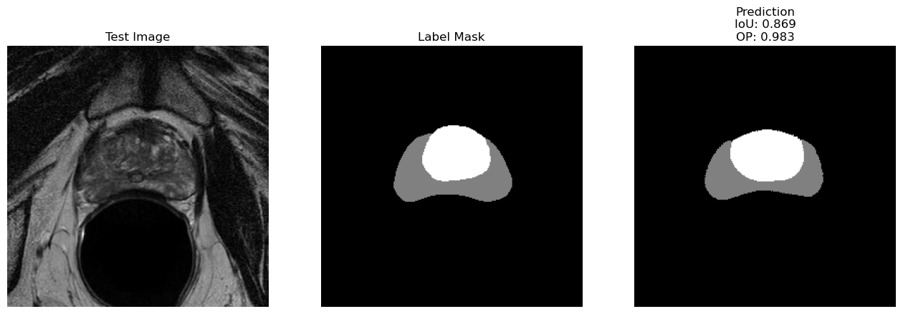

## **Project 3 - Medical Image Segmentation**
by Martin Tschechne, Han Bai, Nora Moser

### **Motivation**

Prostate cancer is the second most common cause of cancer deaths in males and will afflict 1 in 6 men. Many diagnostic prostate biopsies fail to detect occult cancers because of the difficulty in properly determining the prostate’s anatomy. Artificial Intelligence, specifically Deep Learning, can help to overcome the issue of determining the prostate’s anatomy. In this project we build and train the image segmentation model U-Net [1] from scratch in order to segment prostate MRI images into anatomical regions.

### **Data**

For this project we used 3D MRI images from 50 patients for training and from 10 patients for testing. Each 3D image from one patient consists of several 2D images of size 256x256. We like to segment the Peripheral Zone (PZ, class 1) and the Central Gland (CG, class 2) from the background (class 0). The data is heavily imbalanced due to the large background area and single images can also contain only background when PZ or CG segments are not present. The data was part of the <a href="https://wiki.cancerimagingarchive.net/display/Public/NCI-ISBI+2013+Challenge+-+Automated+Segmentation+of+Prostate+Structures">NCI-ISBI 2013 Challenge - Automated Segmentation of Prostate Structures</a>. An example MRI image from the train set is shown below.

|Example Prostate MRI Image from Train set|
|:---:|
| 

 Background: black, CG: white, PZ: gray|
|Train set label distribution: Background: 93.6% PZ: 2.0% CG: 4.4%|

### **Model**

In this project we use the well known U-Net model for medical image segmentation [1] with minor adaptations to our problem. The first half of the model is called <i>contractive path</i> and uses ReLU-activated convolutional layers with batch-normalization and max-pooling, effectively halving the size of the images by two and doubling the number of channels. The second half is called <i>expansive path</i> and applies ReLU-activated convolutional layers with batch-normalization and transposed convolutions, doubling the image size and halving the number of channels in every step. Further the output from each step in the contractive phase is concatenated to the corresponding output of the expansive phase. The figure below illustrates the U-Net architecture of the original publication.To help learning we additionally added Batch-Normalization Layers after the convolutions, further we used same-padding instead of valid-padding.

|U-Net Architecture|
|:---:|
| 

 |

### **Training Protocol & Hyperparameter-Tuning**

Since the data set consists of 3D MRI images from 50 patients, where each 3D image is a set of 2D gray-scale images of one patient, we decided to split the data in a patient-wise fashion rather than an image-wise fashion i.e. we use the 2D images of 40 patients for training and the 2D images of the remaining 10 patients for validation and hyperparameter optimization. This is particularly important since the model must be evaluated on images of new patients, therefore test data leakage must be prohibited and a classical validation split by single images can not be applied since images of one patient would be in the train and validation set.  
In a next step hyperparameter optimization was performed to tune the network to maximum performance.  

For each hyperparameter we proposed a number of choices:

  - Loss function: Focal-Loss [2], Cross-Entropy, Jaccard-Distance, all weighted to account for class imbalances
  - Network Size: number of contractive/expansive passes and filter size, [64,128,256,512] and [8,16,32,64,256,512]
  - Kernel Size: 3x3, 5x5, 7x7
  - Optimizer: Adam, RAdam [3], Lookahead [4] with Adam or RAdam. Each method with learning rates of 1e-4 or 3e-4.

As indicated in [5] hyperparameters can be considered as almost independent from each other and were therefore optimized individually.  
All models were trained with a batch-size of 4 images until no further improvement of validation loss was evident for 20 epochs.  
We found a network with higher number of  contractive/expansive passes, Focal-Loss, 3x3 kernels and Adam optimizer with a learning rate of 3e-4 performing best.  
The final model with the aforementioned hyperparameters was trained on augmented train data (+/- 45° rotations, +/- 0.2 zoom factor and vertical flips) to increase generalization performance and further avoid overfitting of validation data. We trained the model for 500 epochs where the learning rate was reduced by a factor of 0.5 when validation loss did not further improve for 20 epochs.

### **Results**

We measure the performance of the model in terms of Overall Precision (OP), Per-Class Precision (PP) and Intersection of Union (IoU) also called Jaccard-Index. Results are reported on a test set not used for hyperparameter optimization, with and without random rotations.

<table>
<tr><th>Test set </th><th>Test set rotated</th></tr>
<tr><td>
OP: 0.957  PP: 0.817  IoU: 0.549  

|T \ P|0|1|2|
|--|--|--|--|
|**0**|0.993|0.001|0.006|
|**1**|0.570|0.274|0.156|
|**2**|0.466|0.017|0.517|

</td><td>
OP: 0.950  PP: 0.778  IoU: 0.521  

|T \ P|0|1|2|
|--|--|--|--|
|**0**|0.989|0.001|0.009|
|**1**|0.613|0.249|0.138|
|**2**|0.504|0.015|0.480|

</td></tr> </table>

No Information Rates:  
OP: 0.934, PP: 0.311, IoU: 0.311

From the metrics presented above we can conclude that our model performs significantly better than the No Information Rate (i.e. predicting just background) and is able to find overall correct locations of the anatomic structures but possibly fails to draw exact border lines. Finally one can see a slight performance drop for the rotated test set, however the models ability to predict correct locations is still present.

### **Visualizations**

Below are some well segmented predictions from the final model on test data and the original labels.

|Example Test Image and Prediction|
|:---:|
|

|
|

|

### **Reproducibility**

To reproduce the results, download the zipped data form the sources mentioned above. Create the folders `data` and `data/raw` inside the project folder. Extract the zip-file inside `data/raw`. Create `data/processed` and run

`python data/make_dataset.py`

to create train and validation data splits.

Select the configuration file corresponding the the model configuration in the table above from the `config-file` directory and run

`python train_unet.py --config ./config-files/FINAL-MODEL.yaml`

to train the model. Run

`python predict_unet.py --config ./config-files/FINAL-MODEL.yaml`

to perform segmentation on test data and rotated test data.

Performance metrics for each model are saved in the `results` folder in a single sub-folder for each model corresponding to the configuration name.

### **References**

[1] Ronneberger, Olaf & Fischer, Philipp & Brox, Thomas. (2015). U-Net: Convolutional Networks for Biomedical Image Segmentation. LNCS. 9351. 234-241. 10.1007/978-3-319-24574-4_28.

[2] T.-Y. Lin, P. Goyal, R. Girshick, K. He, and P. Dollar. Focal Loss for Dense Object Detection, 2017.

[3] Liu, Liyuan & Jiang, Haoming & He, Pengcheng & Chen, Weizhu & Liu, Xiaodong & Gao, Jianfeng & Han, Jiawei. (2019). On the Variance of the Adaptive Learning Rate and Beyond.

[4] Zhang, Michael & Lucas, James & Hinton, Geoffrey & Ba, Jimmy. (2019). Lookahead Optimizer: k steps forward, 1 step back.

[5] Greff, Klaus & Srivastava, Rupesh & Koutník, Jan & Steunebrink, Bas & Schmidhuber, Jürgen. (2015). LSTM: A search space odyssey. IEEE transactions on neural networks and learning systems. 28. 10.1109/TNNLS.2016.2582924.
