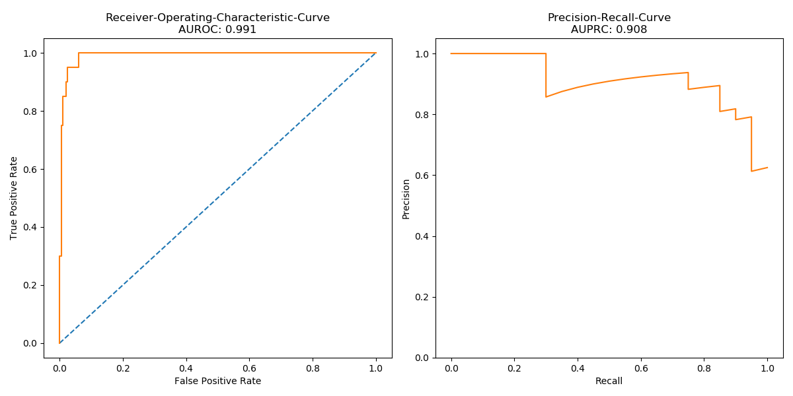
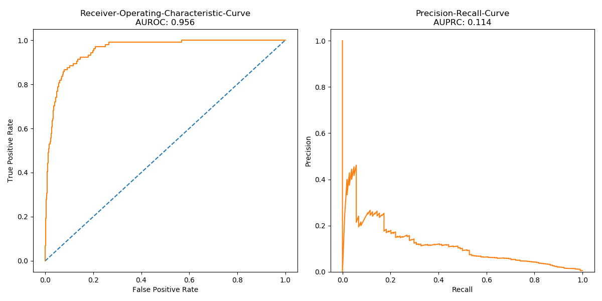

## **Project 4 - Splice Site Prediction**
by Martin Tschechne

### **Motivation**

Splice site prediction is common problem in computational genome finding where it is desirable to find the splice sites that mark the boundaries of <i>exons</i> and <i>introns</i> in organisms whose cells have a nucleus enclosed within membranes (eukaryotes). This classification can then be used to predict a gene's structure, function, interaction or its role in a disease. Splices are characterized by combinations of dimers at the end of the splice site: GU for donor sites and AG for acceptor sites, however only 0.1 - 1% of all occurrences represent true splice sites [1]. Therefore the main challenge of this project is to reduce the number of false positives.

 

- Almost all _donor splice sites_ exhibit GU
- Almost all _acceptor splice sites_ exhibit AG
- Not all GUs and AGs are used as splice site

### **Data**

For this project we use a small data set of premature mRNA transcripts of Caenorhabditis elegans (<a hre="https://de.wikipedia.org/wiki/Caenorhabditis_elegans">C. elegans</a>) and a much larger data set of human premature mRNA transcripts. Both data sets are characterized by heavy class imbalances.

|C.Elegans data|Human data|
|:---|:---|
|sequence length: 82  Class 0: 91.0 % Class 1: 9.0 %  sample size: 2200|sequence length: 398  Class 0: 99.7 % Class 1: 0.3 %  sample size: 500k|

Example of a pre-mRNA transcript from C.Elegans:  
 `ACTGGGATAATTTGAAACAATAAATTTTTTTTTGAATTGTAGGTGTCCTGCTTGCATCCAAAGGAGTCGATGATGTTGAGCA`

### **Preprocessing & Model**

Since the raw transcript of a pre-mRNA sequence is a string which consists only of the letters A, C, G and T we convert each transcript to a very simple numeric vectorized representation by mapping each character to a number: A &rArr; 0, C &rArr; 1, G &rArr; 2, T &rArr; 3.  

 

As model we chose a Convolutional Neural Network with one-dimensional convolutions, max-pooling and fully connected layers on top. Since combinations of letters (AG, GU) play a major role in characterizing a transcript we look at all possible combinations, represented by numerical values, and learn filters which recognize splice sites. We try different filter lengths and pooling sizes. For the human data set we increased the capacity of the model by using more filters in each convolution layer.

### **Hyperparameter-Tuning & Training Protocol**

To find the optimal filter length and pooling size a grid search was conducted. We used filter lengths of size 3, 5 and 7 and max-pooling sizes of 3 and 5. Since the human DNA data set is roughly 200 times larger than the C. elegans data, we used the smaller C. elegans data set to find an optimal set of hyperparameters before approaching the human DNA in order to reduce the amount of needed computational time and resources. To evaluate the models a classical train / validation / test split approach was used: 80% of the data was used to train the models, 10% for validation and early stopping and 10% for the final evaluation. To overcome the class imbalance in the human data set two approaches where tested: downsampling the majority class and upsampling the minority class. Downsampling has the disadvantage that information contained in the samples of the majority class is lost during the sampling process, whereas upsampling comes at a cost of high computational cost given the large size of the data set and the small portion of the minority class.  

 

To train the model we used Adam optimization with default parameters. The model was trained for 50 epochs on the C. elegans data and downsampled human data, resp. 30 epochs on the upsampled human data. The learning rate was reduced by a factor of 2 with a patience of 5 epochs for smaller data sets and 3 epochs for the upsampled human data. We used batch sizes of 16 for C. elegans, 64 for human downsampled and 1024 for human upsampled. All training protocols can be inspected in the source code and the corresponding configuration file for each model.

### **Results**

The best performing model in terms of AUROC returned by the grid search had a filter length of size 3 and max-pooling of size 2, the performance on the test set is summarized in the figure below and evaluations of all models can be seen in the supplementary jupyter notebook. The model for the upsampled human data performed better than the downsampled data. Results on the final test set are summarized in the table and curves below.  

From the quantitative evaluation we can see that predicting splice sites on human transcripts is considerable harder than on transcripts from C. elegans. The major factor for this is the even heavier class imbalance in the human data set, just around 0.3% of all samples are labeled positive. Further human sequences are almost 5 times longer than sequences of C. elegans, larger filter sizes might have improved the performance.

<table>
<tr><th>C.Elegans DNA </th><th>Human DNA</th></tr>
<tr><td>
AUROC: 0.991  AUPRC: 0.908  Accuracy: 0.973  

|T \ P|0|1|
|--|--|--|
|**0**|0.975|0.025|
|**1**|0.050|0.950|

</td><td>
AUROC: 0.956  AUPRC: 0.114  Accuracy: 0.995

|T \ P|0|1|
|--|--|--|
|**0**|0.997|0.003|
|**1**|0.798|0.202|

</td></tr> </table>

|C.Elegans DNA|
|:---:|
| 

 |

|Human DNA|
|:---:|
|

|

### **Reproducibility**

To reproduce the results, create the folders `data` and `data/raw` inside the project folder. Extract the zipped data inside `data/raw`.

Select the configuration file corresponding the the model configuration in the table above from the `config-file` directory and run

`python train_model.py --config ./config-files/model-name.yaml`

to train the model. Run

`python predict_model.py --config ./config-files/model-name.yaml`

to perform splice site prediction on human DNA test data and hidden test data.

Performance metrics for each model are saved in the `results` folder in a single sub-folder for each model corresponding to the configuration name.

### **References**

[1] Splicing ([http://svmcompbio.tuebingen.mpg.de/splicing.html](http://svmcompbio.tuebingen.mpg.de/splicing.html))
